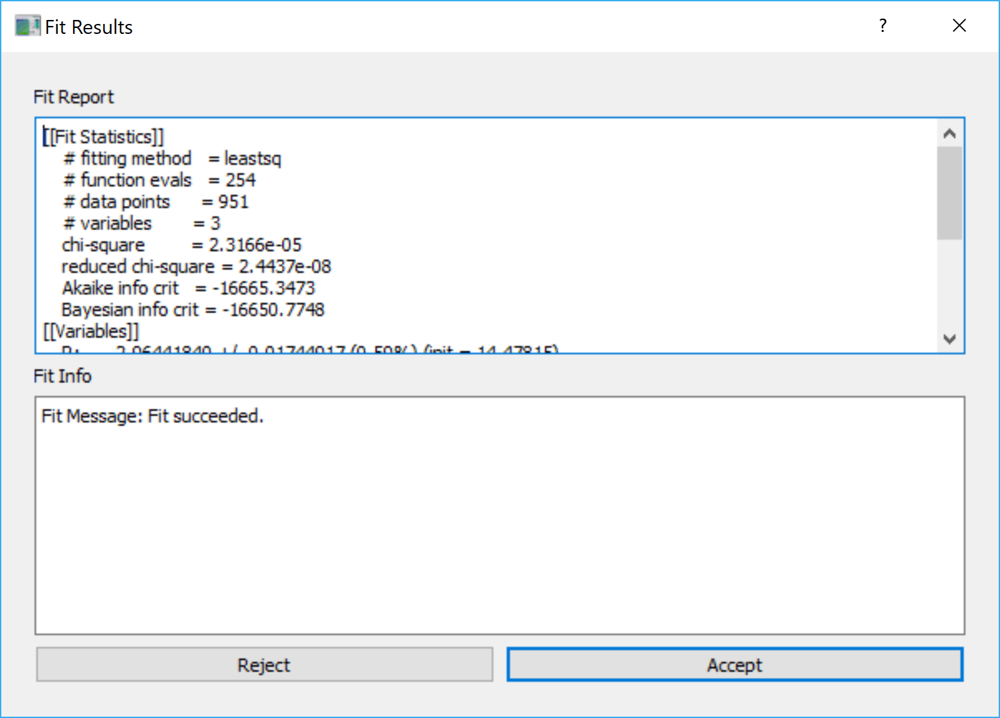
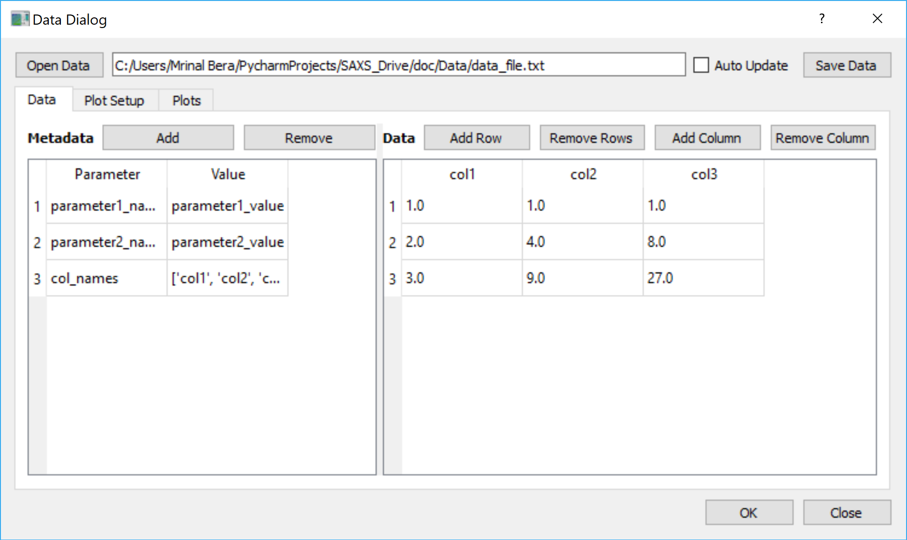
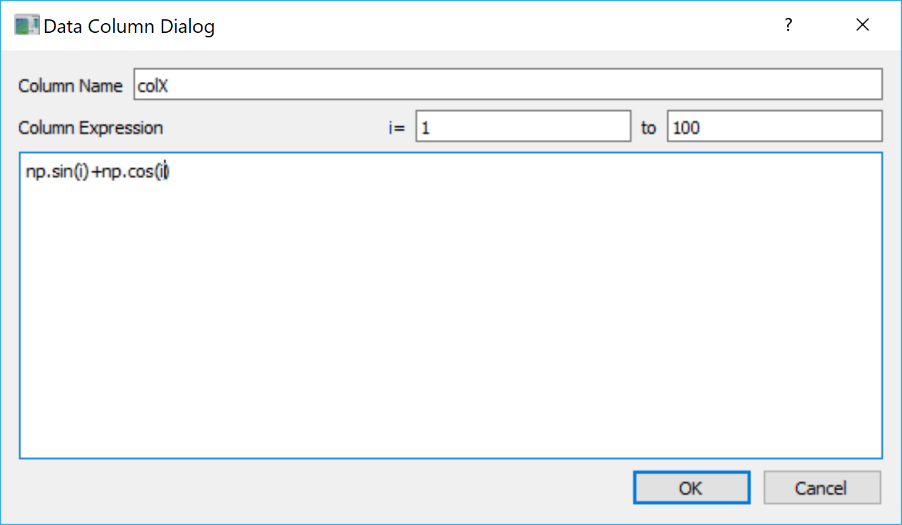

.. _Brief_Tutorial:

Brief Tutorial
==============
This tutorial is focused on showing a beginner how to use the **XModFit** to:

1. Simulate an already available function
2. Data Importing and Fitting
3. Write your own model/function using the :ref:`Function_Editor`

Simulate an already available function
--------------------------------------
The available functions can be simulated by following these steps:

1. Go to a **Function** tab
2. Select a categories among the **Function Categories** which will populate the **Functions** lists with functions/models available for that category.
3. Click on one of the functions which will create a plot the simulated curve in the **Data and Fit** tab and also it will populates the parameter tables in **Parameters** tab with the parameter values required for the functions.
4. The values of **X-axis** of the simulated curve can be changed by changing the **x** parameter located at the to of the **Parameters** tab.
5. All the parameters can be changed and on change of each of the parameters the function/model will be re-calculated and the plot will be updated.

Data importing and fitting
--------------------------
The main objective of **XModFit** is to provide a user to fit a model/function to a data. Please follow these to perform a data fitting using **XModFit**:

1. Click the **Data** tab.
2. Import data file(s) by clicking the **Add Files** button which will prompt for selecting the data files.
3. Once imported the data files with their path will be listed in the **Data files** list below the **Add Files** button
4. Select the data file in the list which you would like to fit.
5. Go to **Functions** tab and select the necessary Category from the **Function Category** list and then select the necessary function from the **Functions** list.
6. Now you will have both data and simulated curve/function plotted as symbols and lines, respectively.
7. At this point play with the parameters value in the **Parameters** tab to make the simulated curve/function close to the data.
8. Once the simulated curve looks very close to the data you can select the parameters available in the **Single fitting parameters** and **Multiple fitting parameters** as fitting parameters by checking out the checkbox (☑) available in box carrying the parameter values.
9. Constraints on the **Single fitting parameters** can be implemented by adding values to the cell corresponding to **Min/Max** columns which are kept by default as **-inf/inf**, respectively, for no limits.
10. Constraints on the **Multiple fitting parameters** can be implemented by **double-clicking** the cell displaying the value of parameter of interest. This will open a dialog to chose for the **Min/Max** values for the parameters which are also kept as **-inf/inf**, respectively, for no constraints.
11. Go back to the **Data** tab and provide the **X-range** of the data in this format **Xmin:Xmax** to perform the fit. By default, the values of **Xmin:Xmax** is taken from the **Xmin** and **Xmax** of the data.
12. Select the **Fit Scale**  between the **Linear|Log** option. By default the **Linear** option is selected. **Fit Scale** determines how the **Chi-Square** (:math:`\chi^2`) will be calculated i.e.:

    * For **Fit Scale=Log**: :math:`\chi^2` is calculated using :math:`\log{(DataY)}-\log{(SimulatedY)}`
    * For **Fit Scale=Linear**: :math:`\chi^2` is calculated using :math:`DataY-SimulatedY`
13. Click the **Fit** button to start fitting the data which will open up a :ref:`Fit_Progress` dialog showing the number of iterations and the :math:`\chi^2` corresponding to the current iterations. The plot of the simulated data will also be updated with the parameters, corresponding to the iteration, as the fit progresses.
14. The iterations will continue until either the minimum :math:`\chi^2` is obtained or **maximum number of iterations (default=1000)**  are reached.
15. Once the fitting concluded a :ref:`Fit_Results` dialog will appear showing all the necessary details about the fitting.
16. At this point the user has freedom to either **Accept/Reject** the fitting results.

    * **Accepting** will update all the fitting parameters with the :math:`\chi^2`-minimized parameters
    * **Rejecting** will keep the parameters unaltered with the values before starting the fit.
17. The `Fit Results` will be available in the `Fit Results` tab besides the `Data and Fit` tab.

.. _Fit_Progress:

.. figure:: ./Figures/Fit_Progress.png
    :figwidth: 30%

    Fit Progress Dialog

.. _Fit_Results:

    Fit Results Dialog

.. _Data_Dialog:

Data Dialog
***********
The dialog provides an interface to import and manipulate data for the **XModFit**.

.. figure:: ./Figures/Data_Dialog.png
    :figwidth: 70%

    Data Dialog in action as a stand-alone data viewer where a file **trial.txt** is imported.

    **Features**

    Data Dialog has several cool features:

    1. It can import any ascii file with tabulated data with the file extensions (**.txt**, **.dat**).
    2. It can show both the meta-data and the data present in the file provided that the data file is written in this particular format as mentioned in :ref:`Data_File_Format`.
    3. After loading the file, both meta-data and the data can be added or removed or modified.
    4. New rows and columns can be added or removed for the data.
    5. Mathematical calculations can be done on the existing columns of the data which will be added as new columns. For data manipulations please follow the instructions in :ref:`Data_Manipulation`.
    6. Provides 1D plots of all/some of the columns of the data. See :ref:`Plotting_With_Data_Dialog`
    7. If the **☐Auto Update** is checked, any change in the data file will update the data automatically in the :ref:`Data_Dialog` along with **Plots**.
    8. Using the **☐Auto Update** feature a datafile can be visualized dynamically on change in the data within the file.

    **Usage**

    The dialog can be used as a dialog to import data in any other widgets like the **XModFit**. For example, within the **XModFit** the :ref:`Data_Dialog` is used to manipulate the data by opening the dialog using the following function::

        from Data_Dialog import Data_Dialog

        def openDataDialog(self,item):
            fnum,fname=item.text().split('<>')
            data_dlg=Data_Dialog(data=self.dlg_data[item.text()],parent=self,expressions=self.expressions[item.text()],plotIndex=self.plotColIndex[item.text()],colors=self.plotColors[item.text()])
            data_dlg.tabWidget.setCurrentIndex(1)
            data_dlg.dataFileLineEdit.setText(fname)
            if data_dlg.exec_():
                self.plotWidget.remove_data(datanames=self.pfnames)
                newFname=data_dlg.dataFileLineEdit.text()
                if fname==newFname:
                    self.plotColIndex[item.text()]=data_dlg.plotColIndex
                    self.plotColors[item.text()]=data_dlg.plotColors
                    self.dlg_data[item.text()]=copy.copy(data_dlg.data)
                    self.data[item.text()]=copy.copy(data_dlg.externalData)
                    self.expressions[item.text()]=data_dlg.expressions
                    for key in self.data[item.text()].keys():
                        self.plotWidget.add_data(self.data[item.text()][key]['x'],self.data[item.text()][key]['y'],yerr=self.data[item.text()][key]['yerr'],name='%s:%s'%(fnum,key),color=self.plotColors[item.text()][key])
                else:
                    text='%s<>%s'%(fnum,newFname)
                    item.setText(text)
                    self.data[text]=self.data.pop(fname)
                    self.dlg_data[text]=self.dlg_data.pop(fname)
                    self.dlg_data[text]=copy.copy(data_dlg.data)
                    self.data[text]=copy.copy(data_dlg.externalData)
                    self.plotColIndex[text]=data_dlg.plotColIndex
                    self.plotColors[text]=data_dlg.plotColors
                    self.expressions[text]=data_dlg.expressions
                    for key in self.data[text].keys():
                        self.plotWidget.add_data(self.data[text][key]['x'], self.data[text][key]['y'], yerr=self.data[text][key][
                        'yerr'],name='%s:%s'%(fnum,key),color=self.plotColors[text][key])
            self.plotWidget.updatePlot()

    The dialog can also be used stand-alone to visualize, manipulate a data file with data and meta-data (see :ref:`Data_File_Format`) by running this command in terminal::

            python Data_Dialog.py [filename]

    where [filename] is an optional argument to provide a file with full path.

.. _Data_File_Format:

Data File Format
----------------
The data file must be written in the format as shown below::

    #Any text about explaining the data
    #parameter1_name=parameter1_value
    #parameter2_name=parameter2_value
    #col_names=['col1','col2','col3']
    1   1   1
    2   4   8
    3   9   27

The first few lines with '#' can be used for stating the details of the file. Any meta-data needs to be saved should
follow the syntax as shown above as '#parameter1_name=parameter1_value'. When the above file is saved as **data_file.txt** and opened in :ref:`Data_Dialog`, the data looks like this:

    Data Dialog in action in which it is loaded with **data_fle.txt**

.. _Data_Manipulation:

Data Manipulation
-----------------
In the :ref:`Data_Dialog` both the meta-data and data can be added/removed and edited with the following conditions:

1. If a file is imported with **col_names** as one of the meta-data, you can edit the values of the **col_names** but cannot remove it.
2. If the columns are already set for plotting in the **Plot Setup** tab you cannot remove the last two tabs.
3. When the :ref:`Data_Dialog` is not used within any other widgets, all the data columns can be removed.
4. When the :ref:`Data_Dialog` is used within any other widgets, one can delete all the columns except the remaining two.

Add New Data Column
+++++++++++++++++++
You can add new columns by clicking **Add Column** which will open up a :ref:`Data_Column_Dialog_i`. Then the column values can be either:

1. An expression of **i** which can take integer values from a minimum value (default=0) to a maximum value (default=100). The expression can be any numpy expression like::

    i**2
    np.sin(i)+np.cos(i)
    np.exp(i*2)

 Here **np** is the imported **numpy** module. Please see :ref:`Data_Column_Dialog_i`.

2. A numpy expression involving the data columns (col_A and col_B in this case) like::

    col['col_A']+col['col_B']
    np.sin(col['col_A'])+np.cos(col['col_B'])
    np.exp(col['col_A'])

 Here a particular column is used as **col.Column_Name**. Please see Data_Column_Dialog_Columns_.

.. _Data_Column_Dialog_i:

    Data Column Dialog with numpy expression involving i

.. _Data_Column_Dialog_Columns:

    Data Column Dialog with numpy expression involving columns

Remove Data Columns
+++++++++++++++++++
The columns can be removed by:

1. Selecting the entire column either by:

   * Selecting the first row of the column and select the last row with **SHIFT** button pressed.
   * Clicking the **Left-Mouse-Button** of the mouse over the first row of the column and keeping the **Left-Mouse-Button** pressed drag all the way to the last column.
   * All the columns can be selected by be clicking on a single data cell and press **CTRL-A**

2. Click the **Remove Column** button.

Add New Data Rows
+++++++++++++++++
A new row can be added by selecting a row where you want to add a row and click **Add Row**

Remove Data Rows
++++++++++++++++
Multiple rows can be removed by selecting multiple rows and click **Remove Rows**

Change Data Column Names
++++++++++++++++++++++++
The column names of the Data can be changed by changing the meta-data **col_names**.

.. _Plotting_With_Data_Dialog:

Plotting with Data Dialog
-------------------------
Data_Dialog_ can also be used for visualizing (within the Data Dialog) and selecting the data (for other widgets) to create 1D plots with errorbars. In order to plot the data needs to be at least a two column data. Once a two-column data is opened, in order to to visualize/select the data for plotting one needs to do the following:

    1) Click to the **Plot Setup** tab. See :ref:`Data_Dialog_Plot_Setup`.
    2) Click **Add** button which will automatically add a row in the table.
    3) By default the row will be loaded with with *Data_0* as label, first and second column of the data as *X* and *Y* column, respectively.
    4) By default the *Yerr* column is selected as *None*.
    5) The color of the plotting symbol can be selected by clicking the color button. By default the plots will choose different variants of *Red*.
    6) Many rows can be added in this way to visualize the data in :ref:`Data_Dialog` whereas when the :ref:`Data_Dialog` is used within other widgets only one row will be added by default.
    7) The data rows can be removed from the **Plot Setup** by selecting entire row (by clicking the row numbers at the extreme left) and clicking the **Remove** button.
    8) When using the :ref:`Data_Dialog` with any other widget, you cannot add or remove plots set for plotting. Though you can change the columns to plot.
    9) All the columns of the data will be available as drop down menu in each of the cells for selecting them as *X*, *Y*, and *Yerr* columns to plot.
    10) After adding the column, go to **Plots** tab within the :ref:`Data_Dialog` to visualize the data. See :ref:`Data_Dialog_Plot_tab`.
    11) Both the X- and Y-axis labels will be updated with the column names selected in the **Plot Setup**.
    12) In order to switch between the log/linear scales of both the axes check/uncheck the **☐LogX** and **☐LogY** checkboxes.
    13) Line-width and the Symbol sizes can be tweaked by changing the **Line width** and **Point size** options.
    14) By default, the errorbars are not plotted and can be plotted by checking the **☐Errorbar** checkbox, provided that a column is already selected in *Yerr* column of the **Plot Setup**.

.. _Data_Dialog_Plot_Setup:

.. figure:: ./Figures/Data_Dialog_Plot_Setup.png
    :figwidth: 70%

    Plot Setup of the Data Dialog

.. _Data_Dialog_Plot_tab:

.. figure:: ./Figures/Data_Dialog_Plot_tab.png
    :figwidth: 70%

    Plot tab of the Data Dialog

.. _Function_Editor:

Function Editor
***************
The editor provides an interface to write new functions to be included
in the **XModFit**. The editor is enabled with python syntax highlighting.

    Function Editor

The editor starts with a template to write new functions. The template looks like this::

    ####Please do not remove lines below####
    from lmfit import Parameters
    import numpy as np
    import sys
    import os
    sys.path.append(os.path.abspath('.'))
    sys.path.append(os.path.abspath('./Functions'))
    sys.path.append(os.path.abspath('./Fortran_rountines'))
    ####Please do not remove lines above####

    ####Import your modules below if needed####

    class FunctionName: #Please put the class name same as the function name
        def __init__(self,x=0,mpar={}):
            """
            Documentation
            x           : independent variable in ter form of a scalar or an array
            """
            if type(x)==list:
                self.x=np.array(x)
            else:
                self.x=x
            self.__mpar__=mpar #If there is any multivalued parameter
            self.choices={} #If there are choices available for any fixed parameters
            self.init_params()

        def init_params(self):
            """
            Define all the fitting parameters like
            self.param.add('sig',value = 0, vary = 0, min = -np.inf, max = np.inf, expr = None, brute_step = None)
            """
            self.params=Parameters()

        def y(self):
            """
            Define the function in terms of x to return some value
            """
            self.output_params={}
            return self.x

A new function is basically as a python **class**. The *class name* determines the name of the function. As per the template there are three essential functions needs to be defined within the **class**:

1. **__init__** function
    . With this function we initialize all the parameters necessary for the class. The function atleast needs a value of an independent parameter **x** which by default takes scaler value **0**. **x** can take a scaler or array of values. **mpar** is a python dictionary to define multiple fitting parameters. The first parameter within **mpar** dictionary should be **list of strings** to provide some information about the nature of other parameters. In order to learn how to use **mpar** please look at the functions like: **MultiSphereAtInterface**, **Parratt**, and **MultiPeaks**.

2. **init_params** function
    . With this function we define among all the parameters (single and multiple) which one will be treated as our fitting parameters.

3. **y** function
    . This function actually returns the actual values of the function to be calculated by the **class**
